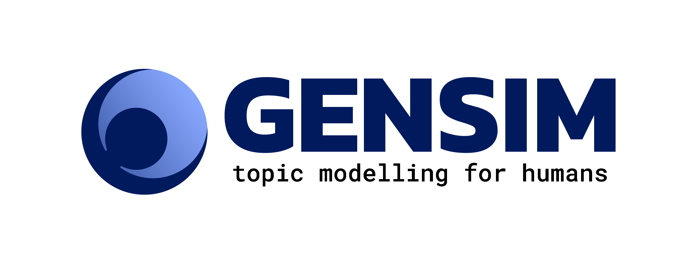

.. _intro:

===============
What is Gensim?
===============

Gensim is a free open-source Python library for representing
documents as semantic vectors, as efficiently (computer-wise) and painlessly (human-wise) as possible.

Gensim is designed to process raw, unstructured digital texts ("*plain text*") using unsupervised machine learning algorithms.

The algorithms in Gensim, such as :class:`~gensim.models.word2vec.Word2Vec`, :class:`~gensim.models.fasttext.FastText`,
Latent Semantic Indexing (LSI, LSA, :class:`~gensim.models.lsimodel.LsiModel`), Latent Dirichlet
Allocation (LDA, :class:`~gensim.models.ldamodel.LdaModel`) etc, automatically discover the semantic
structure of documents by examining statistical
co-occurrence patterns within a corpus of training documents. These algorithms are **unsupervised**,
which means no human input is necessary -- you only need a corpus of plain text documents.

Once these statistical patterns are found, any plain text documents (sentence, phrase, word…) can be succinctly expressed in the new, semantic representation and queried for topical similarity against other documents (words, phrases…).

.. note::
   If the previous paragraphs left you confused, you can read more about the `Vector
   Space Model <http://en.wikipedia.org/wiki/Vector_space_model>`_ and `unsupervised
   document analysis <http://en.wikipedia.org/wiki/Latent_semantic_indexing>`_ on Wikipedia.

.. _design:

Design principles
-----------------

We built Gensim from scratch for:

* **Practicality** -- as industry experts, we focus on proven, battle-hardened algorithms to solve real industry problems. More focus on engineering, less on academia.
* **Memory independence** -- there is no need for the whole training corpus to
  reside fully in RAM at any one time. Can process large, web-scale corpora using data streaming.
* **Performance** – highly optimized implementations of popular vector space algorithms using C, BLAS and memory-mapping.

Installation
------------

Gensim is a Python library, so you need `Python <https://www.python.org/downloads/>`_. Gensim supports all Python versions that haven't reached their `end-of-life <https://devguide.python.org/#status-of-python-branches>`_.

If you need with an older Python (such as Python 2.7), you must install an older version of Gensim (such as `Gensim 3.8.3 <https://github.com/RaRe-Technologies/gensim/releases/tag/3.8.3>`_).

To install gensim, simply run::

  pip install --upgrade gensim

Alternatively, you can download the source code from `Github <https://github.com/RARE-Technologies/gensim/>`__
or the `Python Package Index <http://pypi.python.org/pypi/gensim>`_.

After installation, learn how to use Gensim from its :ref:`sphx_glr_auto_examples_core_run_core_concepts.py` tutorials.

.. _Licensing:

Licensing
----------

Gensim is licensed under the OSI-approved `GNU LGPLv2.1 license <http://www.gnu.org/licenses/old-licenses/lgpl-2.1.en.html>`_.
This means that it's free for both personal and commercial use, but if you make any
modification to Gensim that you distribute to other people, you have to disclose
the source code of these modifications.

Apart from that, you are free to redistribute Gensim in any way you like, though you're
not allowed to modify its license (doh!).

If LGPL doesn't fit your bill, you can ask for :ref:`Commercial support`.

.. _Academic citing:

Academic citing
---------------

Gensim has been used in `over two thousand research papers and student theses <https://scholar.google.com/citations?view_op=view_citation&hl=en&user=9vG_kV0AAAAJ&citation_for_view=9vG_kV0AAAAJ:NaGl4SEjCO4C>`_.

When citing Gensim, please use `this BibTeX entry <bibtex_gensim.bib>`_::

  @inproceedings{rehurek_lrec,
        title = {{Software Framework for Topic Modelling with Large Corpora}},
        author = {Radim {\v R}eh{\r u}{\v r}ek and Petr Sojka},
        booktitle = {{Proceedings of the LREC 2010 Workshop on New
             Challenges for NLP Frameworks}},
        pages = {45--50},
        year = 2010,
        month = May,
        day = 22,
        publisher = {ELRA},
        address = {Valletta, Malta},
        note={\url{http://is.muni.cz/publication/884893/en}},
        language={English}
  }

Gensim = "Generate Similar"
---------------------------

Historically, Gensim started off as a collection of Python scripts for the Czech Digital Mathematics Library `dml.cz <http://dml.cz/>`_ project, back in 2008. The scripts served to generate a short list of the most similar math articles to a given article.

I (Radim) also wanted to try these fancy "Latent Semantic Methods", but the libraries that realized the necessary computation were `not much fun to work with <http://soi.stanford.edu/~rmunk/PROPACK/>`_.

Naturally, I set out to reinvent the wheel. Our `2010 LREC publication <http://radimrehurek.com/lrec2010_final.pdf>`_ describes the initial design decisions behind Gensim: **clarity, efficiency and scalability**. It is fairly representative of how Gensim works even today.

Later versions of Gensim improved this efficiency and scalability tremendously. In fact, I made algorithmic scalability of distributional semantics the topic of my `PhD thesis <http://radimrehurek.com/phd_rehurek.pdf>`_.

By now, Gensim is---to my knowledge---the most robust, efficient and hassle-free piece
of software to realize unsupervised semantic modelling from plain text. It stands
in contrast to brittle homework-assignment-implementations that do not scale on one hand,
and robust java-esque projects that take forever just to run "hello world".

In 2011, I moved Gensim's source code to `Github <https://github.com/piskvorky/gensim>`__
and created the Gensim website. In 2013 Gensim got its current logo, and in 2020 a website redesign.
