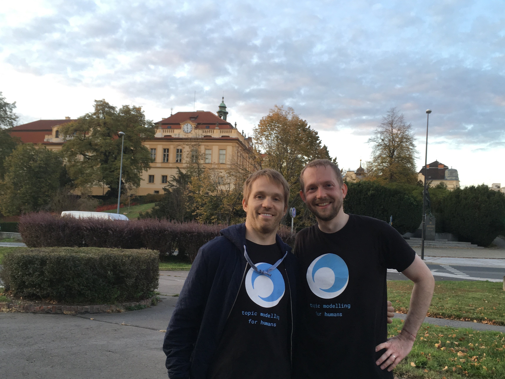

.. _people:

People behind Gensim
====================

.. _contributors:

Top Contributors
----------------

See the `full list of contributors on Github <https://github.com/RaRe-Technologies/gensim/graphs/contributors>`_ and I'm thankful to all of them.

Let me also highlight the "main stars" of Gensim here:

- Radim Řehůřek, `piskvorky <https://github.com/piskvorky>`_: Creator of Gensim AKA me. I prefer not to count the late-night hours volunteered on Gensim development & support since 2009.
- Gordon Mohr, `gojomo <https://github.com/gojomo>`_: Core Gensim contributor, key developer of its doc2vec implementation. ‘Oracle Open Source Developer of the Year’ in 2006, creator of the Heritrix web crawler and the ‘magnet link’.
- Misha Penkov, `mpenkov <https://github.com/mpenkov>`_: Core maintainer and release manager of Gensim, Smart_open, SQLitedict, and other open source packages. Lives and works in Sapporo, Japan.
- Ivan Menshikh, `menshikh-iv <https://github.com/menshikh-iv>`_: Ex-maintainer and mentor in the RARE student incubator.

   RARE photo: Misha (left) and Radim (right) got together in Prague, for some open source hacking & badminton :)

.. _bronze-sponsors:

Bronze Sponsors
---------------

`You? <https://github.com/sponsors/piskvorky>`_

.. _silver-sponsors:

Silver Sponsors
---------------

`You? <https://github.com/sponsors/piskvorky>`_

.. _gold-sponsors:

Gold Sponsors
-------------

`You? <https://github.com/sponsors/piskvorky>`_
